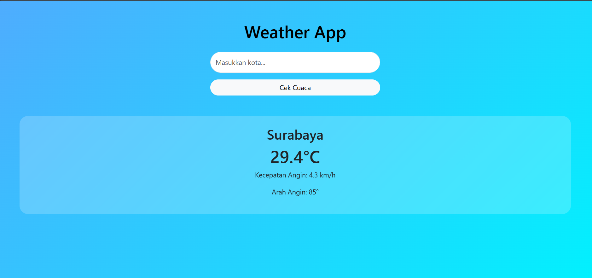

<h1 align="center">🌦️ Weather App Laravel</h1>

Aplikasi web sederhana untuk mengecek cuaca berdasarkan kota menggunakan Laravel dan Open-Meteo API.

## 🚀 Fitur
- Pencarian kota global
- Menampilkan suhu
- Menampilkan kecepatan angin
- UI modern dan responsive

## 🧠 Teknologi
- Laravel
- Bootstrap
- Open-Meteo API

## 🔗 API
- Geocoding: https://geocoding-api.open-meteo.com
- Weather: https://api.open-meteo.com

## 📸 Screenshot

